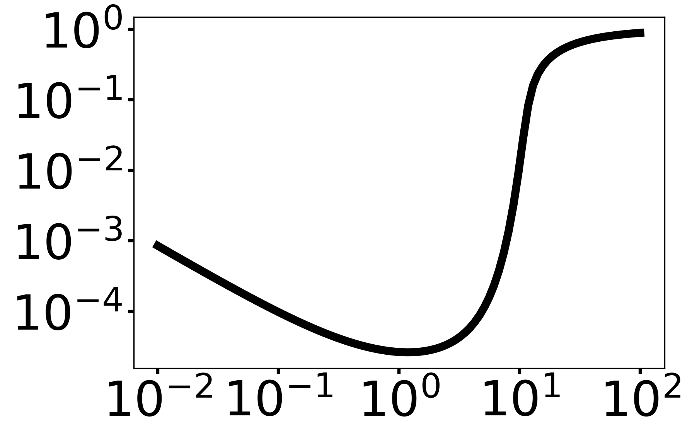
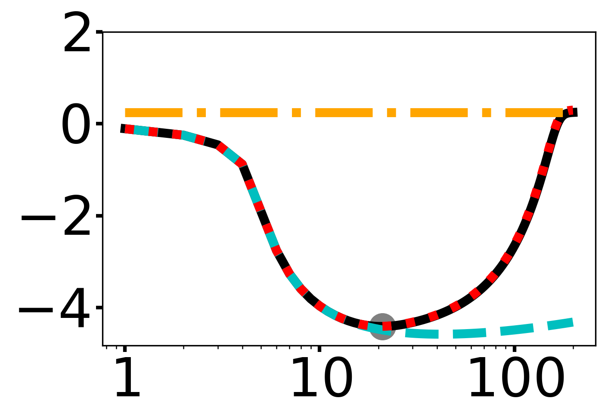

# Code for "Tuning Selection pressure..."

## Overview

[Publication](#publication)

[Brief description of diffusion](#brief-description-of-diffusion)

[Structure of simulation code](#structure-of-simulation-code)

[Directory structure and exectuing code](#directory-structure-and-executing-code)

[Reproducing figures](#reproducing-figures)


## Publication

Work undertaken by Thomas Tunstall, Philip Madgwick, Ricardo Kanitz, and Wolfram Möbius. The corresponding preprint can be found on [bioRxiv](https://doi.org/10.1101/2024.10.23.619847).

We have included all data files and results pertinent to the manuscript (except those larger than 100MB).

## Brief description of diffusion

The migration of susceptible pests is modelled by diffusion. In the thermodynamic limit of a large number of pests, we can approximate the distribution of pests as a continuous distribution of pests, $u_{S}(x,t)$ subject to the diffusion kernel.

The Phases of the simulation:
* $t=0$: The initial conditions: A flat distribution of Susceptible pests with frequency  $u_{S}(x,t)=\Phi$ outside of the Selection regions, and $u_{S}(x,t)=0$ within the Selection region. This is because the Selection regions are intially active, so any Susceptible pests within the Selection region would die.

* $t=p$: While the Selection region is active, any Susceptible pest that would enter the Selection region would be removed from the system. This corresponds to the boundary of the Selection regions ($\partial_\text{Selection}$) being Dirichlet boundary conditions ($u_S(x=\partial_\text{Selection},t)=0$). The distribution of Susceptible pests at $t=p$ is known exactly, $u_S(x,t=p)$, see the main publication.

* $t=1$: For $t>p$, the Selection region is inactive, so Susceptible pests are able to migrate into these regions. This corresponds to convolving the distribution at the end of the Selection period, $u_S(x,t=p)$, with the heat kernel, $K(x)$ for the rest of the time in the simulation (for a time $1-p$): $\frac{1}{\sqrt{4\pi(1-p)}}e^{-\frac{x^2}{4(1-p)} }$.  
The procedure of convolution is achieved quickly with Fast Fourier Transforms and Inverse Fast Fourier Transforms. The pre-breeding distribution of Susceptible pests is equal to $u_S(x,t=1) = u_S(x,t=p)*K(x) \equiv \mathcal{F}^{-1}[\mathcal{F}(u_S(x,t=p))\times \mathcal{F}(K(x))]$. This is evaluated quickly with the `numpy.fft` and `numpy.ifft` functions.

## Structure of code

Similar to the description of the diffusion precedure above, we only compute the Susceptible pest distributions at $t=p$ and $t=1$, using analytical results and convolutions methods, respectively. Following this, breeding is modelled, follwoed by the calculation of the change in Resistant pest number. Below is a snapshot of the code which captures all of this in the case of `Simulations/Single/Global_Minimum`:

```python
#########################################
###Main Process##########################
#########################################

xlist, PAPDist = Core.PAPDist_Single(xbound,L,dx,Phi,PAP)

Kernel = Core.Kernel(PAP,xlist)

EndDist = Core.EndDist_Single(PAPDist,Kernel,xlist,L,dx)

ApproxIntegral = Core.dR(Phi,EndDist,xlist)
```

* The first line produces two 1D numpy arrays: an `xlist` which is simply the x-axis along which diffusion acts on the population distribution, and a `PAPDist`, the distribution of Susceptible pests at $t=p$.

* The second line defines the diffusion dispersal `Kernel` for use later.

* The third line convolves the `PAPDist` and `Kernel`. Note that this uses the `numpy.fft` and `numpy.ifft` in such a way that the convolution is periodic: due to this, the system initially produces is much longer than necessary so the edge effects should have minimal impact on the bulk of the system.

* The fourth line produces a float which is the measure by which the Resistant population has increased: Following breeding, the differences between the final and initial Resistant distributions is integrated over all space.

Variables names here correspond to those in the paper. Variables used in code may deviate.

### Dependencies

The following Python modules are required:

```
numpy
scipy
matplotlib
ArgumentParser
time
```

## Directory structure and exectuing code

Below is a tree respresenting the structure of directories.

```
.
.
├── PublicationFigs
├── RawFigs
└── Simulations
    ├── 2D
    │   ├── Changing_AspectRatio_FixedArea
    │   ├── Changing_Width_Only
    │   ├── Extensions
    │   ├── Global_Minimum_Square
    │   └── HeatMap
    ├── Constrained_Finite
    ├── Constrained_Infinite
    ├── CoreFunctions
    ├── Periodic
    │   ├── Global_Minimum
    │   └── Vary_w
    └── Single
        ├── Global_Minimum
        ├── RemovingDispersalEvents
        ├── SingleSystemEvolution
        └── UpperBound
            ├── Vary_PAP
            └── Vary_Phi
```


### Directory `PublicationFigs`

This stores all the figures used in the publication, constructed from figures in `RawFigs`.

### Directory `RawFigs`

This stores all the figures used in the publication. In order to populate it, execute:

```
$ bash Figure_Copying.sh RawFigs/
```

### Simulations

Here are the directories which house the code used to generate figures for the publication.

#### Single

The case of a single Selction region. There are two points of interest: the global minimum itself, and the upper bound (the region of highest curvature which can be predicted analytically). 

##### Global Minimum 

For $p=0.1, \Phi=10^{-5}$ we vary the length of the Selection region and calculate the change in Resistant pests over a domain so large that the periodic effects of the circular convolution have negligible effect. The result is a detailed global minimum of change in Resistance number per Selection region size with changing Selection region size.




##### RemovingDispersalEvents

For $p=0.1, \Phi=10^{-5}$ we run the same simulation as above, except with the additional option of restricting migration to only occur during the selection phase, the post-selection phase, both phases, or neither phase. Running once for each possibility with the same 


##### SingleSystemEvolution

For $p=0.1, \Phi=10^{-5}$ we run an isolated selection region case for a given $w$, for the sake of visualising how the distribution of each subpopulation changes over a generation 


##### UpperBound

We once again vary the size of the Selection region size $w$, but for different $p$ or $\Phi$ values in `Vary_PAP` and `Vary_Phi`, respectively. This is in order to measure how the region of highest curvature changes with these values, to validate the analytical theory.


#### Periodic

The case of an infinite sequence of Selection and Refuge regions, effectively meaning there is a comparatively small region of Refuge and Selection regions with periodic boundary conditions. The width of the periodic sub-unit is $k$ and the proportion of the region which is Refuge is $\alpha$.

##### Global Minimum

For $p=0.1, \Phi=10^{-5}, \alpha=0.1$ we vary the length of the periodic sub-unit, $k$, and calculate the change in Resistant pests over a domain so large that the periodic effects of the circular convolution have negligible effect. The result is a detailed global minimum of change in Resistance number per periodic sub-region size with changing periodic sub-region size.

##### Vary_w

We again vary the periodic sub-region length $k$, but for different $\alpha$ values in order to measure how the region of minimum gradient changes with $\alpha$ to validate the analytical theory for a lower bound, and how the region of maximum curvature changes with $\alpha$ to validate the analytical theory for the upper bound.


#### Constrained Infinite

Consider a total amount of Selection region, of total width $c$. This is split up into $N$ regions of length $w=C/N$, separated by regions of refuge of width $\delta$. For each N value, we calculate the change in Resistant pest number. At the same time, we approximate the domain with:

* $N$ 'single' regions of length $w$. This is valid when the Selection regions are far away enough to be effectively independent.

* $N$ 'periodic' sub-units of width $k= w+\delta$, with $\alpha = \delta/k$.

* $1$ 'single' region of length $c+(N-1)\delta$: this is accurate when the Selection regions are so close together that the contribution of the Refuge regions between them are negligible.


#### Constrained Finite

Consider a total amount of space where it is possible for Selection region to be placed, of width $h$. The proportion of the region which can be Selection Region is defined by $\beta$. The Selection regions are subdivided into $N$ discrete regions of width $w=h\beta/N$, separated by Refuge regions of width $\delta = h(1-\beta)/(N-1)$ . For each N value, we calculate the change in Resistant pest number. At the same time, we approximate the domain with:

* $N$ 'single' regions of length $w$. This is valid when the Selection regions are far away enough to be effectively independent.

* $N$ 'periodic' sub-units of width $k= w+\delta$, with $\alpha = \delta/k$.

* $1$ 'single' region of length $h$: this is accurate when the Selection regions are so close together that the contribution of the Refuge regions between them are negligible.



#### 2D System

Here we employ a numerical approach to evaluating the diffusion of resistant organisms in a two-dimensional system with rectangular fields.

##### Global Minimum Square
Visualisation of the change in resistant population per square selection region area, for a growing square selection region. We also plot the 1D analogue to draw comparisons.


##### Changing Aspect Ratio, Fixed Area
The change in resistant population per selection region area, except the area is kept constant for each line (50 for the black line, 25 for dark gray, 15 for light gray), and is evaluated for the changing aspect ratio of a rectangular patch.


##### Heatmap
A heatmap for changing height and width of a rectangular seection region, where the colour indicates the change in resistant population per unit selection region area. Values are capped at 3e-5 to capture the minima.


## Reproducing figures

To recreate the data, navigate to the `Host Directory` and execute the corresponding commands.

| Figure(s) | Host Directory | Commands for simulation and creating figure |
| -------------| ------------- | ------------- |
| [1a_i](./RawFigs/Fig1a_1Init.png), [1a_ii](./RawFigs/Fig1a_2PAP.png), [1a_iii](./RawFigs/Fig1a_3End.png), [1a_iv](./RawFigs/Fig1a_4PostBreed.png), [2b_i](./RawFigs/Fig2b_L10.png),[2b_ii](./RawFigs/Fig2b_L20.png),[2b_iii](./RawFigs/Fig2b_L40.png) | `Simulations/Single/SingleSystemEvolution` |`cp SaveFiles/MinL_10.00000_MaxL_40.00000_LNum_3_xbound_1000_dx_1.0E-01_PAP_1.0E-01_Phi_1.0E-05/Params.py .` <br> `python RunFile.py` <br> `python Plotting.py -d SaveFiles/MinL_10.00000_MaxL_40.00000_LNum_3_xbound_1000_dx_1.0E-01_PAP_1.0E-01_Phi_1.0E-05/` |
| [1b](./RawFigs/Fig1b_SingleGlobalMinimum.png), [2a](./RawFigs/Fig2a_SingleGlobalMinimum.png) |`Simulations/Single/Global_Minimum` | `cp SaveFiles/MinL_0.01000_MaxL_100.00000_LNum_100_xbound_1000_dx_1.0E-03_PAP_1.0E-01_Phi_1.0E-05/Params.py .` <br> `python RunFile.py` <br> `python Plotting.py -d SaveFiles/MinL_0.01000_MaxL_100.00000_LNum_100_xbound_1000_dx_1.0E-03_PAP_1.0E-01_Phi_1.0E-05` |
| [2ci](./RawFigs/Fig2ci_UpperBoundWithPhi.png) |`Simulations/Single/UpperBound/Vary_Phi` | `cp SaveFiles/MinL_0.10000_MaxL_1000.00000_LNum_100_xbound_1000_minPhi_-12_maxPhi_-1_Phinum_12_PAP_1.0E-01/Params.py .` <br> `python PhiRunFile.py` <br> `python MultiPlotting.py -d SaveFiles/MinL_0.10000_MaxL_1000.00000_LNum_100_xbound_1000_minPhi_-12_maxPhi_-1_Phinum_12_PAP_1.0E-01` |
| [2cii](./RawFigs/Fig2cii_UpperBoundWithPAP.png) |`Simulations/Single/UpperBound/Vary_PAP` | `cp SaveFiles/MinL_0.10000_MaxL_1000.00000_LNum_100_xbound_1000_minPAP_0.100_maxPAP_0.900_PAPnum_9_Phi_1.0E-05/Params.py .` <br> `python PAPRunFile.py` <br> `python MultiPlotting.py -d SaveFiles/MinL_0.10000_MaxL_1000.00000_LNum_100_xbound_1000_minPAP_0.100_maxPAP_0.900_PAPnum_9_Phi_1.0E-05` |
| [2d](./RawFigs/Fig2d_DifferentDispersals.png) |`Simulations/Single/RemovingDispersalEvents` | `cp SaveFiles/MinL_0.000001_MaxL_100.00000_LNum_100_xbound_10_dx_1.0E-07_PAP_1.0E-01_Phi_1.0E-05_AllMigrations/Params.py .` <br> `python RunFile.py` <br> `cp SaveFiles/MinL_0.000001_MaxL_100.00000_LNum_100_xbound_10_dx_1.0E-07_PAP_1.0E-01_Phi_1.0E-05_NoMigrations/Params.py .` <br> `python RunFile.py` <br>`cp SaveFiles/MinL_0.000001_MaxL_100.00000_LNum_100_xbound_10_dx_1.0E-07_PAP_1.0E-01_Phi_1.0E-05_OnlyPostSelectionMigration/Params.py .` <br> `python RunFile.py` <br> `cp SaveFiles/MinL_0.000001_MaxL_100.00000_LNum_100_xbound_10_dx_1.0E-07_PAP_1.0E-01_Phi_1.0E-05_OnlySelectionMigration/Params.py .` <br> `python RunFile.py` <br> `python MultiPlotting.py -d SaveFiles` |
| [3a](./RawFigs/Fig3a_All_Alpha.png), [3c](./RawFigs/Fig3c_UpperBound_LowerBound_Minimum.png) | `Simulations/Periodic/Vary_w` | `cp SaveFiles/MinK_0.10000_MaxK_1000.00000_KNum_100_minw_0.100_maxw_0.900_wnum_9_PAP_1.0E-01_Phi_1.0E-05/Params.py .` <br> `python wRunFile.py` <br> `python MultiPlotting.py -d SaveFiles/MinK_0.10000_MaxK_1000.00000_KNum_100_minw_0.100_maxw_0.900_wnum_9_PAP_1.0E-01_Phi_1.0E-05` |
| [3b](./RawFigs/Fig3b_PeriodicGlobalMinimum.png) |`Simulations/Periodic/GlobalMinimum` | `cp SaveFiles/MinK_0.10000_MaxK_1000.00000_KNum_100_w_0.100_dx_1.0E-04_PAP_1.0E-01_Phi_1.0E-05/Params.py .` <br> `python RunFile.py` <br> `python Plotting.py -d SaveFiles/MinK_0.10000_MaxK_1000.00000_KNum_100_w_0.100_dx_1.0E-04_PAP_1.0E-01_Phi_1.0E-05` |
| 5 |`Simulations/Constrained_Infinite` | `cp SaveFiles/C_100.000_d_0.100_MinN_1.00000_MaxN_200.00000_NNum_200_xbound_1000_dx_1.0E-03_PAP_1.0E-01_Phi_1.0E-05/Params.py .` <br> `python RunFile.py` <br> `cp SaveFiles/C_100.000_d_10.000_MinN_1.00000_MaxN_200.00000_NNum_200_xbound_1000_dx_5.0E-03_PAP_1.0E-01_Phi_1.0E-05/Params.py .` <br> `python RunFile.py` <br> `cp SaveFiles/C_100.000_d_1.000_MinN_1.00000_MaxN_200.00000_NNum_200_xbound_1000_dx_5.0E-03_PAP_1.0E-01_Phi_1.0E-05/Params.py .` <br> `python RunFile.py` <br> `cp SaveFiles/C_10.000_d_0.100_MinN_1.00000_MaxN_100.00000_NNum_100_xbound_1000_dx_1.0E-03_PAP_1.0E-01_Phi_1.0E-05/Params.py .` <br> `python RunFile.py` <br> `cp SaveFiles/C_10.000_d_10.000_MinN_1.00000_MaxN_100.00000_NNum_100_xbound_1000_dx_1.0E-03_PAP_1.0E-01_Phi_1.0E-05/Params.py .` <br> `python RunFile.py` <br> `cp SaveFiles/C_10.000_d_1.000_MinN_1.00000_MaxN_100.00000_NNum_100_xbound_1000_dx_1.0E-03_PAP_1.0E-01_Phi_1.0E-05/Params.py .` <br> `python RunFile.py` <br> `cp SaveFiles/C_1.000_d_0.100_MinN_1.00000_MaxN_1000.00000_NNum_42_xbound_100_dx_1.0E-05_PAP_1.0E-01_Phi_1.0E-05/Params.py .` <br> `python RunFile.py` <br> `cp SaveFiles/C_1.000_d_10.000_MinN_1.00000_MaxN_1000.00000_NNum_42_xbound_100_dx_1.0E-05_PAP_1.0E-01_Phi_1.0E-05/Params.py .` <br> `python RunFile.py` <br> `cp SaveFiles/C_1.000_d_1.000_MinN_1.00000_MaxN_1000.00000_NNum_42_xbound_100_dx_1.0E-05_PAP_1.0E-01_Phi_1.0E-05/Params.py .` <br> `python RunFile.py` <br> `bash BashPlotting.sh` |
| 6 |`Simulations/Constrained_Finite` | `cp SaveFiles/D_1000.000_B_0.500_MinN_1.00000_MaxN_2001.00000_NNum_201_xbound_1000_dx_2.5E-03_PAP_1.0E-01_Phi_1.0E-05/Params.py .` <br> `python RunFile.py` <br> `cp SaveFiles/D_1000.000_B_0.800_MinN_1.00000_MaxN_2001.00000_NNum_201_xbound_1000_dx_1.0E-03_PAP_1.0E-01_Phi_1.0E-05/Params.py .` <br> `python RunFile.py` <br> `cp SaveFiles/D_100.000_B_0.500_MinN_1.00000_MaxN_200.00000_NNum_200_xbound_1000_dx_2.5E-03_PAP_1.0E-01_Phi_1.0E-05/Params.py .` <br> `python RunFile.py` <br> `cp SaveFiles/D_100.000_B_0.800_MinN_1.00000_MaxN_200.00000_NNum_200_xbound_1000_dx_1.0E-03_PAP_1.0E-01_Phi_1.0E-05/Params.py .` <br> `python RunFile.py` <br> `cp SaveFiles/D_10.000_B_0.500_MinN_1.00000_MaxN_20.00000_NNum_20_xbound_1000_dx_2.5E-03_PAP_1.0E-01_Phi_1.0E-05/Params.py .` <br> `python RunFile.py` <br> `cp SaveFiles/D_10.000_B_0.800_MinN_1.00000_MaxN_20.00000_NNum_20_xbound_1000_dx_1.0E-03_PAP_1.0E-01_Phi_1.0E-05/Params.py .` <br> `python RunFile.py` <br> `bash BashPlotting.sh` |
| [7a](./RawFigs/2D_ChangingSize.png) |`Simulations/2D/Global_Minimum_Square` | `cp SaveFiles/Minw_0.10000_Maxw_100.00000_LNum_31_PAP_1.0E-01_Phi_1.0E-05_dt_1.0E-03_dx_1.0E-03/Params.py .` <br> `python RunFile.py` <br>  `python Plotting.py -d SaveFiles/Minw_0.10000_Maxw_100.00000_LNum_31_PAP_1.0E-01_Phi_1.0E-05_dt_1.0E-03_dx_1.0E-03` |
| [7b](./RawFigs/2D_FixedArea_ChangingAspectRatio.png) |`Simulations/2D/Changing_AspectRatio_FixedArea` | `cp SaveFiles/Mina_3.00000_Maxa_200.00000_aNum_21_Area_15.000_PAP_1.0E-01_Phi_1.0E-05_dt_1.0E-03_dx_1.0E-03/Params.py .` <br> `python RunFile.py` <br>  `cp SaveFiles/Mina_3.00000_Maxa_200.00000_aNum_21_Area_25.000_PAP_1.0E-01_Phi_1.0E-05_dt_1.0E-03_dx_1.0E-03/Params.py .` <br> `python RunFile.py` <br>`cp SaveFiles/Mina_3.00000_Maxa_200.00000_aNum_21_Area_50.000_PAP_1.0E-01_Phi_1.0E-05_dt_1.0E-03_dx_1.0E-03/Params.py .` <br> `python RunFile.py` <br>`python MultiPlotting.py -d SaveFiles/` |
| [7c](2D_HeatMap.png) |`Simulations/2D/HeatMap` | `cp SaveFiles/Minw_0.56234_Maxw_10.00000_wNum_21_Minh_0.56234_Maxh_10.00000_hNum_21_PAP_1.0E-01_Phi_1.0E-05_dt_1.0E-03_dx_1.0E-03/Params.py .` <br> `python RunFile.py` <br>  `python Plotting.py -d SaveFiles/Minw_0.56234_Maxw_10.00000_wNum_21_Minh_0.56234_Maxh_10.00000_hNum_21_PAP_1.0E-01_Phi_1.0E-05_dt_1.0E-03_dx_1.0E-03` |
